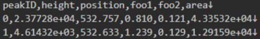
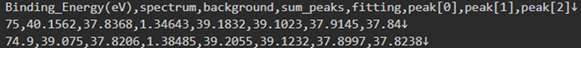
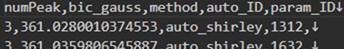
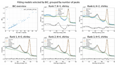
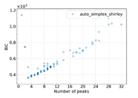
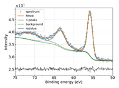
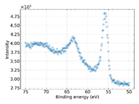

# ピーク分離テンプレート

## 概要

スペクトルデータに対してフォークト関数を基底関数としてピークフィッティングを行い、その結果をベイズ情報量規準(BIC)で評価して上位のフィッティング結果を出力するテンプレートです。入力ファイルは、2列の数字データのcsvフォーマットに対応しています。論理モデルは、疑似フォークト(pseudo voigt)関数と畳み込みフォークト(convolution voigt)関数に対応しています。

## カタログ番号

- DT0013
    - ピーク分離テンプレート

## 登録データについて

本データセットテンプレートで作成したデータセットには、'スペクトルデータファイル'と'解析結果ファイル'を登録することができます。なお、スペクトルデータは１つ登録する必要があります。

### スペクトルデータファイル

以下は本データセットテンプレートに登録可能なスペクトルデータファイルです。

| 種類 | 命名規則 | 説明 |
| :---- | :---- | :---- |
| csvフォーマット|  | スペクトルデータ |

- スペクトルデータファイルの中身 (以下、例(`foo.csv`))
    ```
    35.0,409.0
    34.875,414.0
    34.75,401.0
    34.625,386.0
    34.5,394.0
    ・・・
    ```
  - スペクトルデータはヘッダなし2列のCSV形式であること。
  - 第1列はエネルギーで降順に並んでいること。
  - 第2列は強度で0以上の正の実数値であること。

### 解析結果ファイル

解析結果ファイルは、スペクトルデータファイルを読み込んでフィッティングを行った結果出力されるファイルです。

| ファイル名 | 内容 | 備考 |
|:----|:----|:----|
| metadata.json | 主要パラメータメタ情報ファイル | (中身は空) |
| \*_parameters.csv | ピークパラメータの数字データ |  |
| \*_result.csv | フィッティング結果を描画するための数値データ |  |
| summary_BIC.csv | ピーク本数とBICの数値データ |  |
| result_figures.pptx | まとめスライドのパワーポイント |  |
| \*_summary0001-*.png | まとめスライドの画像 |  |
| BIC_vs_NumPeak.png | BIC vs. ピーク本数の図 |  |
| \*_result.png | フィッティング画像 |  |
| input_spectrum2.png | 入力スペクトルの図 |  |

### メタ情報

次のように、大きく２つに分類されます。

- 基本情報
- 固有情報

#### 基本情報

基本情報はすべてのデータセットテンプレート共通のメタです。詳細は[データセット閲覧 RDE Dataset Viewer > マニュアル](https://dice.nims.go.jp/services/RDE/RDE_manual.pdf)を参照してください。

#### 固有情報

固有情報はデータセットテンプレート特有のメタです。以下は本データセットテンプレートに設定されている固有メタ情報項目です。

|項目名|必須|日本語語彙|英語語彙|単位|初期値|データ型|フォーマット|備考|
|:----|:----|:----|:----|:----|:----|:----|:----|:----|
|model_type||モデルの種類|Model type||convolution voigt|string||["pseudo voigt", "convolution voigt"]|
|noise_type||ノイズの種類|Noise type||gauss|string||["gauss", "poisson"]|
|common_data_type||登録データタイプ|Data type||BIC-fitting|string|||
|common_data_origin||データの起源|Data Origin||experiments|string||["experiments", "informatics and data science", "simulations", "theory", "other"]|
|common_technical_category||技術カテゴリー|Technical Category||calculation|string|||
|common_reference||参考文献|Reference||H. Shinotsuka, H. Yoshikawa, R. Murakami, K. Nakamura, H. Tanaka, K. Yoshihara, Automated information compression of XPS spectrum using information criteria, Journal of Electron Spectroscopy and Related Phenomena. 239 (2020) 146903. https://doi.org/10.1016/j.elspec.2019.146903.|string|||
|calculation.calculation_method||計算方法|Calculation method||BIC-fitting|string|||
|calculation.supercom_or_pc||SuperComまたはPC|SuperCom or PC||azure cloud|string|||
|calculation.os||オペレーティングシステム|OS||Debian GNU/Linux 13 (trixie)|string||疑似Voigtの場合は「XPS Peak Separation Tool」を上書きする。|
|calculation.software_name||ソフトウェア名称|Software name||XPS-peak-separation-convolutionVoigt|string||疑似Voigtの場合は「xps-ps-pv-20220419」を上書きする。|
|calculation.software_version||ソフトウェアバージョン|Software version||xps-ps-cv-20240712|string|||
|calculation.software_reference||ソフトウェア参照|Software reference||https://doi.org/10.1016/j.elspec.2019.146903|string|||
|calculation.operator||計算実行者|Operator||RDE|string|||
|calculation.calculated_date||計算日|Calculated date|||string|YYYY-MM-DD|登録日から自動取得|
|calculation.material_name||物質名|Material name|||string|||
|calculation.key_object||キーの配列/計算される主な物性|Key object|||string||疑似Voigtの場合は「Peak number, Peak position, Peak height, Peak width, Lorentz ratio, Peak area」を上書きする。|

## データカタログ項目

データカタログの項目です。データカタログはデータセット管理者がデータセットの内容を第三者に説明するためのスペースです。

|RDE用パラメータ名|日本語語彙|英語語彙|データ型|備考|
|:----|:----|:----|:----|:----|
|dataset_title|データセット名|Dataset Title|string||
|abstract|概要|Abstract|string||
|data_creator|作成者|Data Creator|string||
|language|言語|Language|string||
|experimental_apparatus|使用装置|Experimental Apparatus|string||
|data_distribution|データの再配布|Data Distribution|string||
|raw_data_type|データの種類|Raw Data Type|string||
|stored_data|格納データ|Stored Data|string||
|remarks|備考|Remarks|string||
|references|参考論文|References|string||

## 構造化処理の詳細

### 設定ファイルの説明

構造化処理を行う際の、設定ファイル(`rdeconfig.yaml`)の項目についての説明です。

| 階層 | 項目名 | 語彙 | データ型 | 標準設定値 | 備考 |
|:----|:----|:----|:----|:----|:----|
| system | extended_mode | 動作モード | string | (なし) | 計測データファイル一括投入時'MultiDataTile'を設定。 |
| system | magic_variable | マジックネーム | string | true | 計測データファイル名 = データ名としない場合は'false'に設定。 |
| system | save_thumbnail_image | サムネイル画像保存  | string | true | |

### dataset関数の説明

ピーク分離テンプレートが出力するデータを使用した構造化処理を行います。以下関数内で行っている処理の説明です。

```python
def dataset(srcpaths: RdeInputDirPaths, resource_paths: RdeOutputResourcePath) -> None:
    """Execute structured processing in peak separation.

    Args:
        srcpaths (RdeInputDirPaths): Paths to input resources for processing.
        resource_paths (RdeOutputResourcePath): Paths to output resources for saving results.

    Returns:
        None

    """
```

### 入力ファイルのチェック
- 入力ファイルのチェック(入力ファイルをアップロードしたか・それはcsvファイルかどうか)を行う。
```python
    module.file_reader.check(resource_paths)
```

### ピーク分離を行う
- 入力ファイルを読み込んで、ピーク分離を行い、構造化ファイル・グラフ画像を作成する。
```python
    # Read invoice and fitting data.
    invoice_obj = module.invoice_writer.read_invoice(resource_paths.invoice_org)
    module.file_reader.fit(resource_paths, invoice_obj)
```

### 構造化ファイルの移動
- ピーク分離を行った際の構造化ファイルを、RDEの所定のディレクトリに移動する。
```python
    # Move csv file.
    module.structured_processer.move_files(resource_paths, invoice_obj)
```

### 空ファイル(メタデータファイル)の作成
- 空ファイル(メタデータファイル)を、RDEの所定のディレクトリに作成する(システム都合上)。
```python
    # Output meta. (empty)
    module.meta_parser.save_meta(
        resource_paths.meta.joinpath("metadata.json"),
        Meta(srcpaths.tasksupport.joinpath("metadata-def.json")),
        const_meta_info={},
        repeated_meta_info={},
    )
```

### グラフ画像ファイルの移動
- ピーク分離を行った際のグラフ画像ファイルを、RDEの所定のディレクトリに移動する。
```python
    # Move graph file.
    module.graph_plotter.move_files(resource_paths)
```

### 送り状の上書き
- 送り状の一部項目(ソフトウェア名称、ソフトウェアバージョン、キーの配列/計算される主な物性)を、所定の値で上書きする。
```python
    # Overwrite invoice
    module.invoice_writer.overwrite_invoice_calculation(resource_paths, invoice_obj)
```

## データセットテンプレートシートについて

　メタデータ定義(metadata-def.json)、送状定義(invoice.schema.json)、カタログ定義(catalog.schema.json)をエクセル形式のシートから生成することができるツールを以下に用意してあります。

[RDE/データセットテンプレート生成、確認ツール](https://github.com/nims-mdpf/RDE_datasettemplate-schemafile-make-tool)

　上記のツールで利用可能な本データセットテンプレート用のデータセットテンプレートシートは以下の通りです。

- [templates](./RDEDatasetTemplateSheet_RDE_PEAK_SEPARATION.xlsx)

